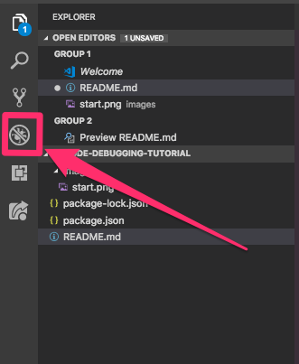
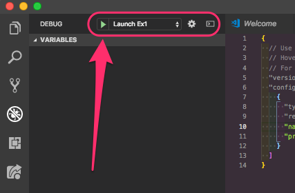

# Debugging using VSCode

The goal of this simple repository is to give an introduction to vscode and its use as a debugger.
# Project Overview

This project contains several files that we will be diving into:

* **ex1-hello-world**
  * A simple `Hello World` example, just to make sure that everyone is set up and ready to roll.
* **ex2-booleans**
  * Here we see how simple code changes can make boolean statements much easier to understand, and to enable us to debug more effectively.
  * We will be modifying this code to make it easier to undestand.
* **ex3-express**
  * A simple server example, showing how even servers even can be debugged.
  * In this example, we will be using breakpoint expressions to help us in our debugging.
* **ex4-for-loop**
  * This is a more real world look, but still simple Javascript function will look like, and how we can use debugging to notice slowness.
  * We will be modifying this code to make it faster, and the affects will be readily apparently during our debugging.
* **ex5-binary-search**
  * Another real world scenario using a recursive binary search. This time, we show the power of understanding exactly what data is where.
* **ex6-memoization**
  * Another real-world example showing how we can observe a memoized structure being built in real time.
* **ex7-testing**
  * The final real world example showing how to write and run tests for these modules.

The fourth is a collection of test cases, 

## How to Use this Project

### Opening

1. Clone using `git clone https://github.com/tamsanh/vscode-debugging-tutorial`
2. Navigate to the project directory you just cloned. `cd vscode-debugging-tutorial`
3. Use npm to install the packages with `npm install`
4. Open up the project in vscode using `code .`

### Debugging

The main feature we will be taking a look at, today, will be the debugging feature. You can find this debugging feature when you click this "Debug" icon.

After opening the debug menu, you can use the launcher to launch each of the individual projects.

All projects have a separate configuration in the `launch.json` configuration. This means that they can all be launched directly from the debugger menu.

Each of the projects will have their own individual `README.md` file to give you an idea of what to expect.