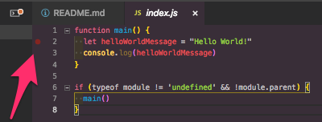
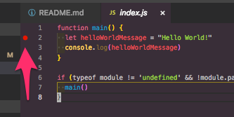
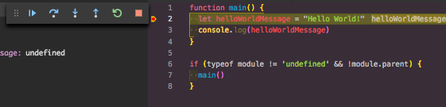
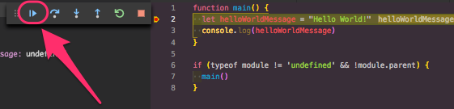

# Hello World

This first example is purely to make sure we are set up and up and running.

## Lesson

### Breakpoints

To place a breakpoint, move your mouse cursor to the left side gutter, next to the line numbers.

When you hover, you should see a red dot. This shows that you can place a breakpoint on that line.

To place the breakpoint, simply click on the highlighted red dot. You will know when it is placed when the red dot solidifies.

### Running

Now that we've set a breakpoint, we can launch the example.

Make sure you're on the `Debug` menu by clicking the `Debug` icon on the menu panel.

Then, select `Launch Ex1` and click the green Run button.

The code should stop where you've put the break point, and will look like this.

**Congratulations! You've successfully run your code in debug mode!**

Click the play button to continue the rest of the code.

## Assignment

Please put a break point on the line 3, and launch the example.

The Debug Console should open up, and the final output should look like this.

### Output

### Bonus

Change the output message to say, "Hello Tamu!" without changing any of the code.