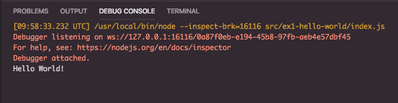

# Hello World

This first example is purely to make sure we are set up and up and running.

## Assignment

Please put a break point on the line 3, and launch the example.

The Debug Console should open up, and the final output should look like this.

### Output

### Bonus

Change the output message to say, "Hello Tamu!" without changing any of the code.