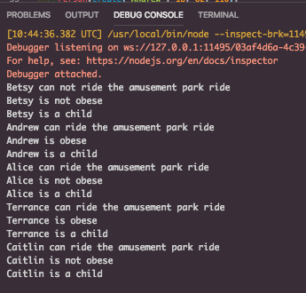

# Booleans

In this example, we explore boolean expression.

We have a simple Person class with some metrics about the person that we wish to know.

## Assignment

Modify the code so that the example is easier to debug, and so that it works properly.

**Hint:** Use named variables to make this job easier

You must make it easier to understand what each of the boolean statements is trying to do.

### Output

## Bonus

Create instance functions to output this data on its own.

## Double Bonus

Create a pure functional variant of this code.