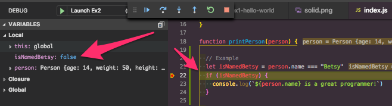

# Booleans

In this example, we explore boolean expression.

We have a simple Person class with some metrics about the person that we wish to know.

## Lesson

Variables and their values are visible on the top left hand side, under the `Variables` heading.

When code execution has stopped, you can view these values on the left hand side.

## Assignment

Modify the code to look more like the example on line 22.
This will make it easier to debug, because you can watch how the values change.

You must make it easier to understand what each of the boolean statements is trying to do.

### Output

## Bonus

Create instance functions to output this data on its own.

## Double Bonus

Create a pure functional variant of this code.