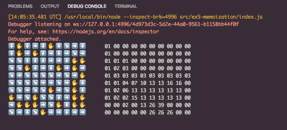

# Memoization

This example shows how useful the debugger is for understanding the shape of our data and very complex operations.

It also shows how we can also debug tests, to make it easier and more sustainable to write our code in a Test Driven Development way.

## Lesson

In this lesson, we will see that we can actually run tests using the debugger.

Take a look at the `launch.json` configuration for this code, on your own, to see how mocha can be run using it. I don't expect you to necessarily memorize the entire setup, but it's good to at least understand what's going on.

## Assignment

This is the final assignment which will take advantage of all of the separate techniques we have learned, up until this point.

Using your new-found debugger knowledge, fix all of the bugs in this memoization function.

Read the code, tests, and use the debugger, to try to figure out what this code does, and fix it.

For an extra challenge, start from `bonus.js` instead of `index.js`, to implement the functions.

## Solution

This should be the following output.

## Bonus

For an extra challenge, start from the `bonus.js` without using the `index.js` file.
